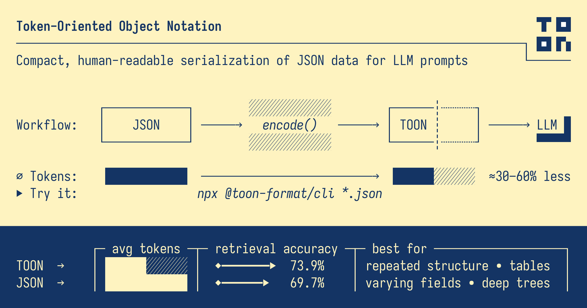

# Token Optimizer

[](https://www.oracle.com/java/)
[](LICENSE)
[](https://github.com/toon-format/spec)
[](https://central.sonatype.com/artifact/dev.sassine/token-optimizer)
[](https://github.com/Sassine/token-optimizer/releases)

Java library to optimize payload format by comparing JSON vs TOON and automatically returning the format that consumes fewer tokens.

## 📦 Latest Release

**Current Version:** `1.1.2`  
**Status:** ✅ Published to [Maven Central](https://central.sonatype.com/artifact/dev.sassine/token-optimizer)  
**Release Date:** November 2025

[View on Maven Central](https://central.sonatype.com/artifact/dev.sassine/token-optimizer) | [View Releases](https://github.com/Sassine/token-optimizer/releases)

## 📋 Description

Token Optimizer is a library that allows you to convert Java objects or JSON strings to both JSON and TOON formats, count the number of tokens in each format, and automatically return the format with the lowest token count.

This library implements the [official TOON specification v2.0](https://github.com/toon-format/spec) and has been validated against the official TOON library.

## ✨ Features

- ✅ Converts Java objects to JSON using ObjectMapper
- ✅ Converts Java objects to TOON format (hierarchical compact format)
- ✅ **Two token counting methods:**
  - Generic estimation algorithm (fast, works for any model)
  - **Tiktoken integration** (accurate, model-specific counting for GPT, Claude, etc.)
- ✅ Automatically returns the format with the lowest token count
- ✅ **Multiple optimization criteria** - Optimize by tokens (LLMs), bytes (storage), or characters (size analysis)
- ✅ **Optimization Policy** - Control format selection with configurable thresholds
- ✅ **Multiple metrics** - Token count, character count, and byte count for comprehensive analysis
- ✅ **Reverse conversion** - Convert TOON strings back to JSON or Java objects
- ✅ Supports simple and complex objects (nested, arrays, etc.)
- ✅ Compiled with Java 24, compatible with Java 11+ projects
- ✅ **100% compliant with official TOON specification v2.0**
- ✅ Validated against official `@toon-format/toon` library

## 📁 Project Structure

```
token-optimizer/
├── lib-java/          # Java library source code
│   ├── src/          # Source files
│   ├── pom.xml       # Maven configuration
│   └── ...
├── frontend/         # Frontend comparison tool
│   ├── index.html    # Web interface
│   ├── server.js     # Node.js server for official TOON
│   └── ...
└── docs/            # Documentation
    └── ...
```

## 🚀 Quick Start

### Installation

**Maven** — Add the dependency to your `pom.xml`:

```xml
<dependency>
    <groupId>dev.sassine</groupId>
    <artifactId>token-optimizer</artifactId>
    <version>1.1.2</version>
</dependency>
```

**Gradle** — Add to your `build.gradle`:

```groovy
implementation 'dev.sassine:token-optimizer:1.1.2'
```

Or with Kotlin DSL (`build.gradle.kts`):

```kotlin
implementation("dev.sassine:token-optimizer:1.1.2")
```

**📦 Available on Maven Central:** [central.sonatype.com/artifact/dev.sassine/token-optimizer](https://central.sonatype.com/artifact/dev.sassine/token-optimizer)

### Basic Usage

#### Method 1: Generic Token Estimation (Default)

```java
import dev.sassine.tokenoptimizer.TokenOptimizer;
import dev.sassine.tokenoptimizer.OptimizationResult;
import java.util.HashMap;
import java.util.Map;

// Create an object
Map<String, Object> person = new HashMap<>();
person.put("name", "John");
person.put("age", 30);
person.put("city", "New York");

// Optimize using generic estimation (works for any model)
OptimizationResult result = TokenOptimizer.optimize(person);

// Get results
System.out.println("Optimal format: " + result.getOptimalFormat()); // JSON or TOON
System.out.println("Optimal content: " + result.getOptimalContent());
System.out.println("JSON tokens: " + result.getJsonTokenCount());
System.out.println("TOON tokens: " + result.getToonTokenCount());
System.out.println("Savings: " + result.getTokenSavings() + " tokens (" + 
                   String.format("%.2f", result.getTokenSavingsPercentage()) + "%)");
```

#### Method 2: Model-Specific Token Counting (Tiktoken)

```java
import dev.sassine.tokenoptimizer.TokenOptimizer;
import dev.sassine.tokenoptimizer.OptimizationResult;
import com.knuddels.jtokkit.api.ModelType;
import java.util.HashMap;
import java.util.Map;

// Create an object
Map<String, Object> person = new HashMap<>();
person.put("name", "John");
person.put("age", 30);
person.put("city", "New York");

// Optimize using GPT-4 tokenizer (accurate token counting)
OptimizationResult result = TokenOptimizer.optimize(person, ModelType.GPT_4);

// Or use GPT-3.5 Turbo
OptimizationResult result2 = TokenOptimizer.optimize(person, ModelType.GPT_3_5_TURBO);

// Or use Claude models (same encoding as GPT-4)
OptimizationResult result3 = TokenOptimizer.optimize(person, ModelType.GPT_4); // Claude uses GPT-4 encoding

// Get results (same as above)
System.out.println("Optimal format: " + result.getOptimalFormat());
System.out.println("JSON tokens: " + result.getJsonTokenCount());
System.out.println("TOON tokens: " + result.getToonTokenCount());
```

### From JSON String

```java
String jsonString = """
    {
      "blog": {
        "posts": [
          {
            "id": "post-1",
            "title": "Getting Started with JSON",
            "author": "Jane Doe",
            "publishedAt": "2025-01-10",
            "tags": ["tutorial", "json", "beginner"],
            "comments": 15,
            "likes": 42
          }
        ],
        "analytics": {
          "totalViews": 1250,
          "uniqueVisitors": 890
        }
      }
    }
    """;

OptimizationResult result = TokenOptimizer.optimizeFromJson(jsonString);
String optimizedContent = result.getOptimalContent();
```

### Optimization Criteria

Choose what metric to optimize for: tokens, bytes, or characters:

```java
// Optimize by tokens (default - for LLM usage)
OptimizationResult byTokens = TokenOptimizer.optimize(person);

// Optimize by bytes (for data persistence/storage)
OptimizationResult byBytes = TokenOptimizer.optimizeByBytes(person);

// Optimize by characters (for size analysis)
OptimizationResult byChars = TokenOptimizer.optimizeByCharacters(person);

// From JSON string
OptimizationResult byBytes = TokenOptimizer.optimizeFromJsonByBytes(jsonString);
OptimizationResult byChars = TokenOptimizer.optimizeFromJsonByCharacters(jsonString);
```

**Note:** Different criteria can produce different optimal formats! Tokens are best for LLM costs, bytes for storage, and characters for size analysis.

### Optimization Policy

Control how the optimizer selects formats using `OptimizationPolicy`:

```java
import dev.sassine.tokenoptimizer.OptimizationPolicy;
import dev.sassine.tokenoptimizer.PayloadFormat;

// Create a policy
OptimizationPolicy policy = OptimizationPolicy.builder()
    .preferFormat(PayloadFormat.AUTO)              // AUTO, JSON_ONLY, or TOON_ONLY
    .minSavingsPercentForSwitch(5.0)               // Only switch if savings ≥ 5%
    .build();

// Use the policy
OptimizationResult result = TokenOptimizer.optimize(person, policy);

// Policy options:
// - PayloadFormat.AUTO: Choose format with lowest tokens (respects threshold)
// - PayloadFormat.JSON_ONLY: Always use JSON
// - PayloadFormat.TOON_ONLY: Always use TOON
```

### Multiple Metrics

Get comprehensive metrics for both LLM usage and data persistence:

```java
OptimizationResult result = TokenOptimizer.optimize(person);

// Token metrics (for LLM usage)
int tokens = result.getOptimalTokenCount();
double tokenSavings = result.getTokenSavingsPercentage();

// Character metrics (for size analysis)
int chars = result.getOptimalCharacterCount();
double charSavings = result.getCharacterSavingsPercentage();

// Byte metrics (for data persistence)
int bytes = result.getOptimalByteCount();
double byteSavings = result.getByteSavingsPercentage();

System.out.println(result); // Shows all metrics
```

### Reverse Conversion (TOON → JSON/Object)

Convert TOON strings back to JSON or Java objects:

```java
// TOON → JSON
String toonString = "name: John\nage: 30";
String json = TokenOptimizer.fromToonToJson(toonString);
// Result: {"name":"John","age":30}

// TOON → Object
Object obj = TokenOptimizer.fromToon(toonString);
// Result: Map with name="John", age=30

// TOON → Typed Class
MyClass obj = TokenOptimizer.fromToon(toonString, MyClass.class);
```

## 📊 Real Test Results

All examples have been tested and validated against the official TOON library. Here are the actual results:

### Example 1: Simple Object
```
Input: {name: "John", age: 30, city: "New York"}

┌─────────────┬──────────┬──────────┬─────────────┐
│   Format    │  Tokens  │  Status  │  Savings   │
├─────────────┼──────────┼──────────┼─────────────┤
│    JSON     │    7     │  ✅ WIN  │      -     │
│    TOON     │    9     │    ❌    │   -2 (22%) │
└─────────────┴──────────┴──────────┴─────────────┘

Decision: JSON selected (7 tokens < 9 tokens)
✅ Validated: Identical to official TOON library
```

### Example 2: Complex Blog Structure
```
Input: Blog with posts array and analytics

┌─────────────┬──────────┬──────────┬─────────────┐
│   Format    │  Tokens  │  Status  │  Savings   │
├─────────────┼──────────┼──────────┼─────────────┤
│    JSON     │   86     │  ✅ WIN  │      -     │
│    TOON     │  115     │    ❌    │  -29 (34%) │
└─────────────┴──────────┴──────────┴─────────────┘

Decision: JSON selected (86 tokens < 115 tokens)
✅ Validated: Identical to official TOON library
```

**TOON Output:**
```
blog:
  posts[2]:
    - id: post-1
      title: Getting Started with JSON
      author: Jane Doe
      publishedAt: 2025-01-10
      tags[3]: tutorial,json,beginner
      comments: 15
      likes: 42
    - id: post-2
      title: Advanced Data Structures
      author: John Smith
      publishedAt: 2025-01-12
      tags[3]: advanced,algorithms,data-structures
      comments: 8
      likes: 28
  analytics:
    totalViews: 1250
    uniqueVisitors: 890
```

### Example 3: Nested Object
```
Input: Person with address object

┌─────────────┬──────────┬──────────┬─────────────┐
│   Format    │  Tokens  │  Status  │  Savings   │
├─────────────┼──────────┼──────────┼─────────────┤
│    JSON     │   13     │  ✅ WIN  │      -     │
│    TOON     │   18     │    ❌    │   -5 (28%) │
└─────────────┴──────────┴──────────┴─────────────┘

Decision: JSON selected (13 tokens < 18 tokens)
✅ Validated: Identical to official TOON library
```

### Example 4: Large Array with Long Property Names (TOON Wins!)
```
Input: 25 objects with very long property names (47+ chars) and short values

┌─────────────┬──────────┬──────────┬─────────────┐
│   Format    │  Tokens  │  Status  │  Savings   │
├─────────────┼──────────┼──────────┼─────────────┤
│    JSON     │   977    │    ❌    │      -     │
│    TOON     │   110    │  ✅ WIN  │ +867 (89%) │
└─────────────┴──────────┴──────────┴─────────────┘

Decision: TOON selected (110 tokens < 977 tokens)
✅ Validated: Identical to official TOON library
```

**TOON Output (compact format):**
```
metrics[25]{applicationPerformanceMonitoringMetricStatus,applicationPerformanceMonitoringMetricType,applicationPerformanceMonitoringMetricTimestamp,applicationPerformanceMonitoringMetricIdentifier,applicationPerformanceMonitoringMetricValue,applicationPerformanceMonitoringMetricCategory}:
  A,T,1,"1",1,C
  A,T,2,"2",2,C
  A,T,3,"3",3,C
  ...
  A,T,25,"25",25,C
```

## 🎯 When Does TOON Win?

Based on real testing, TOON format is more efficient when:

✅ **Large arrays** (20+ objects) with uniform structure
✅ **Very long property names** (40+ characters) - JSON repeats them N times
✅ **Short values** (1-3 characters) - minimizes TOON formatting overhead
✅ **Many properties per object** (5+ properties) - increases JSON repetition penalty

**Example 4 demonstrates this perfectly:**
- 25 objects with 6 properties each
- Property names ~47 characters long
- Values are 1-2 characters
- **Result: TOON saves 867 tokens (88.74% reduction)!**

## 📚 TOON Format Specification

This library implements the [official TOON specification v2.0](https://github.com/toon-format/spec/blob/main/SPEC.md).



### Format Rules

1. **Simple Properties**: `key: value`
2. **Nested Objects**: Indented with 2 spaces per level
   ```
   parent:
     child: value
   ```
3. **Arrays of Objects (Uniform)**: Uses compact format `[count]{prop1,prop2,prop3}:` with values in lines
   ```
   items[2]{sku,qty,price}:
     A1,2,9.99
     B2,1,14.5
   ```
4. **Arrays of Objects (Non-uniform)**: Uses expanded format with `-` prefix
   ```
   posts[2]:
     - id: post-1
       title: Getting Started
     - id: post-2
       title: Advanced Topics
   ```
5. **Simple Arrays**: Uses `[count]:` notation with comma-separated values
   ```
   tags[3]: tutorial,json,beginner
   ```
6. **String Values**: 
   - Strings that are pure numbers need quotes: `"1"` vs `1` (number)
   - Strings with special characters need quotes
   - Regular strings don't need quotes

## 🔧 API Reference

### TokenOptimizer

Main class of the library.

#### Static Methods:

**Generic Estimation (Default):**
- `optimize(Object obj)` - Optimizes a Java object using generic token estimation
- `optimizeFromJson(String jsonString)` - Optimizes from a JSON string using generic estimation
- `getOptimizedContent(Object obj)` - Returns only the optimized content (generic estimation)
- `getOptimizedContentFromJson(String jsonString)` - Returns only the optimized content from JSON (generic estimation)

**Model-Specific (Tiktoken):**
- `optimize(Object obj, ModelType modelType)` - Optimizes using tiktoken for the specified model (null = generic)
- `optimizeFromJson(String jsonString, ModelType modelType)` - Optimizes from JSON using tiktoken (null = generic)
- `getOptimizedContent(Object obj, ModelType modelType)` - Returns optimized content using tiktoken (null = generic)
- `getOptimizedContentFromJson(String jsonString, ModelType modelType)` - Returns optimized content from JSON using tiktoken (null = generic)

### TokenCounter

Utility class for counting tokens in strings.

#### Static Methods:

- `countTokens(String text)` - Counts tokens using generic estimation
- `countTokens(String text, ModelType modelType)` - Counts tokens using tiktoken (null = generic)

### OptimizationResult

Immutable class that contains the optimization result with comprehensive metrics.

#### Methods:

**Format & Content:**
- `getOptimalFormat()` - Returns the optimal format (`FormatType.JSON` or `FormatType.TOON`)
- `getOptimalContent()` - Returns the content in optimal format
- `getJsonContent()` - Returns the content in JSON format
- `getToonContent()` - Returns the content in TOON format

**Token Metrics:**
- `getOptimalTokenCount()` - Returns the token count of the optimal format
- `getJsonTokenCount()` - Returns the JSON token count
- `getToonTokenCount()` - Returns the TOON token count
- `getTokenSavings()` - Returns the token savings (absolute)
- `getTokenSavingsPercentage()` - Returns the token savings percentage (0.0 to 100.0)

**Character Metrics:**
- `getOptimalCharacterCount()` - Returns the character count of the optimal format
- `getJsonCharacterCount()` - Returns the JSON character count
- `getToonCharacterCount()` - Returns the TOON character count
- `getCharacterSavings()` - Returns the character savings (absolute)
- `getCharacterSavingsPercentage()` - Returns the character savings percentage

**Byte Metrics:**
- `getOptimalByteCount()` - Returns the byte count of the optimal format (UTF-8)
- `getJsonByteCount()` - Returns the JSON byte count
- `getToonByteCount()` - Returns the TOON byte count
- `getByteSavings()` - Returns the byte savings (absolute)
- `getByteSavingsPercentage()` - Returns the byte savings percentage

### OptimizationCriteria

Enum that defines which metric is used to select the optimal format.

#### Values:

- `TOKENS` - Compare based on token count (default). Best for LLM API usage
- `BYTES` - Compare based on byte count (UTF-8). Best for data persistence/storage
- `CHARACTERS` - Compare based on character count. Best for size analysis

### OptimizationPolicy

Policy class to control format selection with configurable thresholds. Built using the builder pattern.

#### Builder Methods:

- `OptimizationPolicy.builder()` - Creates a new builder
- `.preferFormat(PayloadFormat)` - Sets the format strategy (`AUTO`, `JSON_ONLY`, or `TOON_ONLY`)
- `.minSavingsPercentForSwitch(double)` - Minimum savings percentage to switch formats (0.0 to 100.0)
- `.build()` - Builds the policy instance

### PayloadFormat

Enum representing the preferred payload format strategy.

#### Values:

- `AUTO` - Automatically choose the format with the lowest metric, respecting the minimum savings threshold
- `JSON_ONLY` - Always use JSON format, regardless of comparison results
- `TOON_ONLY` - Always use TOON format, regardless of comparison results

## 🧪 Testing & Validation

The library includes comprehensive tests and validation against the official TOON library:

1. **Unit Tests**: Located in `lib-java/src/test/java/`
2. **Example Classes**: Located in `lib-java/src/examples/` (not included in JAR)
3. **Frontend Tool**: Visual comparison tool in `frontend/` directory

### Running Tests

```bash
cd lib-java

# Run unit tests
mvn test

# Run examples (using scripts - compiles examples separately)
./run-example.sh    # Linux/Mac
run-example.bat     # Windows
```

**Note:** Example classes are in `src/examples/` and are compiled separately. They are **NOT included** in the library JAR.

### Frontend Comparison Tool

A frontend tool is available in the `frontend/` directory to visually compare our Java implementation with the official TOON library.

**Setup:**
```bash
cd frontend
npm install
npm run server  # Starts Node.js server with official TOON library
```

**Usage:**
- The Java `Example.java` automatically connects to the server
- Visual comparison available at `http://localhost:8080` (after `npm start`)

See `frontend/README.md` for more details.

## ⚙️ Requirements

- **Java 11 or higher** (library compiled with Java 24, bytecode compatible with Java 11+)
- **Maven 3.6+** (for building)
- **Jackson Databind** (included as dependency)
- **jtokkit** (included as dependency) - For tiktoken integration

## 🏗️ Building from Source

```bash
cd lib-java

# Build library JAR (excludes example classes)
mvn clean package -DskipTests

# The JAR will be in target/token-optimizer-1.1.2.jar
# Contains only the library classes: TokenOptimizer, TokenCounter, ToonConverter, OptimizationResult
```

**Note:** Example classes (`Example.java`, `ExampleWithTiktoken.java`, `ToonComparisonClient.java`) are located in `src/examples/` and are **NOT included** in the library JAR. They are for demonstration purposes only.

## 🎨 Performance & Best Practices

The library follows clean code principles and performance optimizations:

- ✅ **Immutable classes**: All result classes are final and immutable
- ✅ **Utility classes**: Prevented instantiation with private constructors
- ✅ **Efficient string operations**: Uses StringBuilder with pre-allocated capacity
- ✅ **Null safety**: Proper null checks and validation
- ✅ **Constants**: Magic numbers replaced with named constants
- ✅ **Optimized algorithms**: Efficient token counting without unnecessary array creation
- ✅ **Type safety**: Proper type checking and casting for compatibility

## 📝 License

This project is licensed under the MIT License - see the LICENSE file for details.

## 🙏 Acknowledgments

- [TOON Format Specification](https://github.com/toon-format/spec) - Official TOON specification v2.0
- [@toon-format/toon](https://www.npmjs.com/package/@toon-format/toon) - Official TOON JavaScript library used for validation
- [jtokkit](https://github.com/knuddelsgmbh/jtokkit) - Java implementation of tiktoken for accurate token counting

## 📞 Contributing

Contributions are welcome! Please feel free to submit a Pull Request.

---

**Made with ❤️ for efficient token usage in LLM applications**
